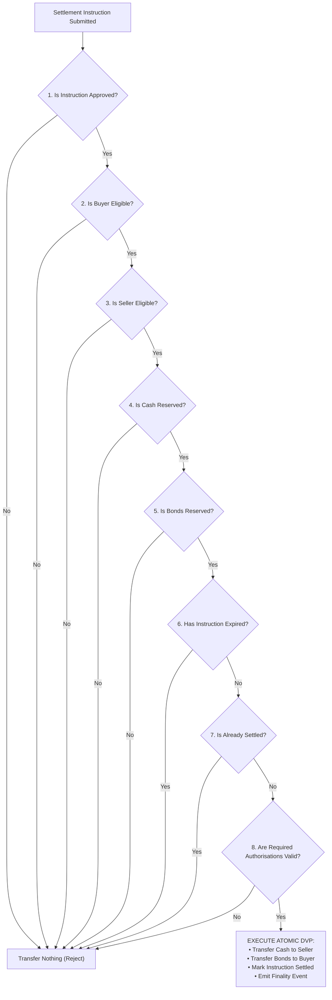

# ⚡ Smart Contract Pre-Built Conditional Settlement Engine Specification

## 📌 Executive Summary
The platform features an on-chain, pre-built deterministic conditional settlement solution for institutional digital-asset acquisitions. Institutional market participants can establish parameterized guardrails prior to trade commitment. Execution is strictly governed by an atomic, invariant-checked state machine guaranteeing Delivery-versus-Payment (DvP) finality or zero state mutation.

---

## 🏛️ Authoritative Smart Contract Decision Logic



---

## 📜 Formal Decision Rules

```text
IF:
  settlementInstruction is approved
  AND buyer is eligible
  AND seller is eligible
  AND cash is reserved
  AND bonds are reserved
  AND instruction has not expired
  AND instruction has not settled
  AND required authorisations are valid

THEN:
  transfer cash to seller
  transfer bonds to buyer
  mark instruction settled
  emit finality event

ELSE:
  transfer nothing
```

---

## 🦀 Rust Reference Implementation & Unit Test Verification

Implemented in `crates/settlement-engine/src/lib.rs`:

```rust
pub fn evaluate_and_execute_conditional_dvp(
    &self,
    mut instruction: ConditionalSettlementInstruction,
    current_time: u64,
) -> SettlementExecutionResult {
    if instruction.is_approved
        && instruction.is_buyer_eligible
        && instruction.is_seller_eligible
        && instruction.is_cash_reserved
        && instruction.is_bonds_reserved
        && current_time <= instruction.expiry_timestamp
        && !instruction.is_settled
        && instruction.required_authorisations_valid
    {
        instruction.is_settled = true;
        SettlementExecutionResult::Settled {
            instruction_id: instruction.instruction_id.clone(),
            cash_transferred_to_seller: instruction.cash_amount,
            bonds_transferred_to_buyer: instruction.bond_amount,
            finality_event: format!("FINALITY_DVP_ATOMIC_{}", instruction.instruction_id),
        }
    } else {
        let mut reasons = Vec::new();
        if !instruction.is_approved { reasons.push("settlementInstruction is not approved"); }
        if !instruction.is_buyer_eligible { reasons.push("buyer is not eligible"); }
        if !instruction.is_seller_eligible { reasons.push("seller is not eligible"); }
        if !instruction.is_cash_reserved { reasons.push("cash is not reserved"); }
        if !instruction.is_bonds_reserved { reasons.push("bonds are not reserved"); }
        if current_time > instruction.expiry_timestamp { reasons.push("instruction has expired"); }
        if instruction.is_settled { reasons.push("instruction has already settled"); }
        if !instruction.required_authorisations_valid { reasons.push("required authorisations are invalid"); }

        SettlementExecutionResult::TransferredNothing {
            reason: reasons.join("; "),
        }
    }
}
```

### Verified Test Cases:
1. `test_conditional_settlement_all_conditions_met`: Validates that when all 8 gates pass, cash moves to seller, bonds move to buyer, instruction is marked settled, and `FINALITY_DVP_ATOMIC_*` is emitted.
2. `test_conditional_settlement_condition_failed_transfers_nothing`: Validates that if any gate fails (e.g. seller not eligible or bonds unreserved), zero state mutation occurs (`transfer nothing`) and detailed error diagnostics are returned.
